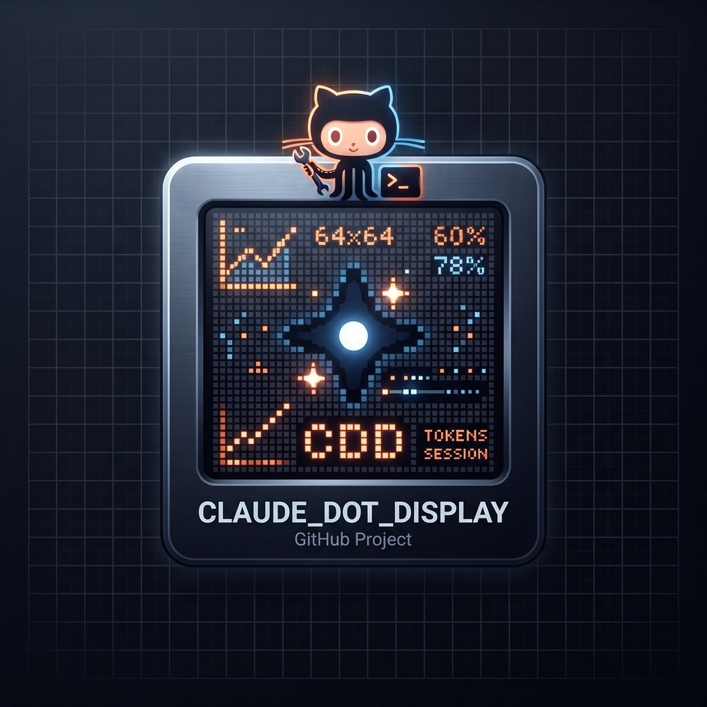

<div align="center">



# claude-dot-display

**Your Claude Code sessions, on an LED matrix.**

[](https://github.com/MrMarco74/claude_dot_display/actions/workflows/ci.yml)
[](LICENSE)
[](https://www.python.org/)
[](#status)

</div>

---

`claude-dot-display` turns a 64x64 iDotMatrix LED panel into an ambient status
board for your Claude Code sessions. Each running session gets a row: its name
in a colour that tells you its state, and how many stages it has left.

- **blue** — running
- **amber** — waiting on a question
- **red** — hit an issue
- **green** — done

When nothing is running, the panel switches to a summary of your token usage.

Underneath it is an original, MIT-licensed implementation of the iDotMatrix
BLE protocol, usable on its own.

## Status

Alpha, and honest about it. The repository is being built in phases:

| Phase | What | State |
| --- | --- | --- |
| P0 | Repo foundation | **done** |
| P1 | BLE driver | **done** — verified against hardware |
| P2 | Board, renderer, daemon | **done** — running as a service |
| P3 | Claude Code plugin | not started |

Install the plugin today and it does nothing yet — it carries no hooks or
skills until P3. It exists so the install path is real and testable.

[`PROTOCOL.md`](PROTOCOL.md) is already worth reading if you own one of these
panels. Everything in it is marked with whether it has been replayed against
real hardware yet — at this stage, none of it has.

## Why we wrote our own protocol layer

Every Python library for these panels is **GPL-3.0**:

| Project | Licence |
| --- | --- |
| [`derkalle4/python3-idotmatrix-client`](https://github.com/derkalle4/python3-idotmatrix-client) | GPL-3.0 |
| [`markusressel/idotmatrix-api-client`](https://github.com/markusressel/idotmatrix-api-client) | GPL-3.0 |
| `python3-idotmatrix-library` (upstream of both) | GPL-3.0 |

Those projects did the original work of making these panels usable at all, and
this one would not exist without the path they cut. But their licence is
viral: anything that links them inherits it. A project cannot honestly call
itself MIT while requiring a GPL-3.0 library at runtime.

We wanted this to be **really** free — usable in commercial work, in
proprietary tools, in anything at all, with no obligations flowing back. So we
wrote the protocol layer ourselves.

**Clean-room, and we mean it.** No GPL source was read. The protocol was
derived from bytes observed on the wire against real hardware — the vendor's
own phone application talking to the panel, captured over Bluetooth HCI and
decoded. Protocol facts are not copyrightable, but provenance is what makes
that defensible, so [`PROTOCOL.md`](PROTOCOL.md) records for every command
where it was captured and whether it has been replayed.

### It turned out faster, too

Going to the wire directly answered a question the existing libraries had not:
how the vendor app uploads a full frame so quickly. It sends the panel raw
RGB888 in three chunks. This driver does the same in a **measured 0.77
seconds** — the per-pixel approach the GPL libraries use takes roughly **6
seconds** for the same frame.

The pixel ordering — row-major, origin top-left — was established by
uploading three images that differ from a black baseline by exactly one pixel,
at three known corners, and finding that pixel in each payload. Measured, not
inferred.

If you only want a permissively licensed way to talk to one of these panels,
take `dotdisplay.ble` and ignore the rest.

## Requirements

- Python 3.11 or newer
- A Bluetooth LE adapter within range of the panel
- A 64x64 iDotMatrix panel

**No pairing is needed** — the panel accepts connections unpaired. What you
do need is its Bluetooth address:

```bash
dotdisplay discover          # lists panels in range as IDM-<six hex digits>
dotdisplay check             # shows a code on the panel to confirm it
```

`check` matters when more than one panel is around: reachability only proves
that *something* answered, while seeing the code proves the address points at
the panel you are looking at.

Other iDotMatrix sizes are untested. We only claim what we have verified
against hardware.

## Install

```bash
pipx install claude-dot-display
```

Not yet published — see Status.

## Licence

MIT — see [LICENSE](LICENSE).
